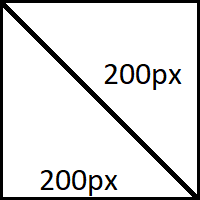

## Pandoc image sizing when converting from Jupyter notebook to LaTeX

I am attempting to use `pandoc` to convert a Jupyter Notebook into a readable pdf.
I have read the [pandoc manual](https://pandoc.org/MANUAL.html#images) section regarding images.
~~Unfortunately the `ipynb` to `pdf` does not appear to be working as expected.~~

```bash
pandoc --version
```

gives

```
pandoc 2.12
Compiled with pandoc-types 1.22, texmath 0.12.1.1, skylighting 0.10.4,
citeproc 0.3.0.8, ipynb 0.1.0.1
```

Here is an image, where I would like to specify the width

{ width=1cm }

```markdown
{ width=1cm }
```

Running:

```bash
pandoc -s -o README.tex README.md
xelatex README.tex
```

gives:

```latex
\begin{figure}
\centering
\includegraphics[width=1cm,height=\textheight]{test_image.png}
\caption{Image Caption}
\end{figure}
```

And, if I put 

```markdown
{ width=1cm }
```

in a markdown cell in a notebook, and run

```bash
pandoc --from ipynb+link_attributes -s -o Pandoc_problems.tex Pandoc_problems.ipynb
xelatex Pandoc_problems.tex
```

I get:

```latex
\includegraphics[width=1cm,height=\textheight]{test_image.png}
```
